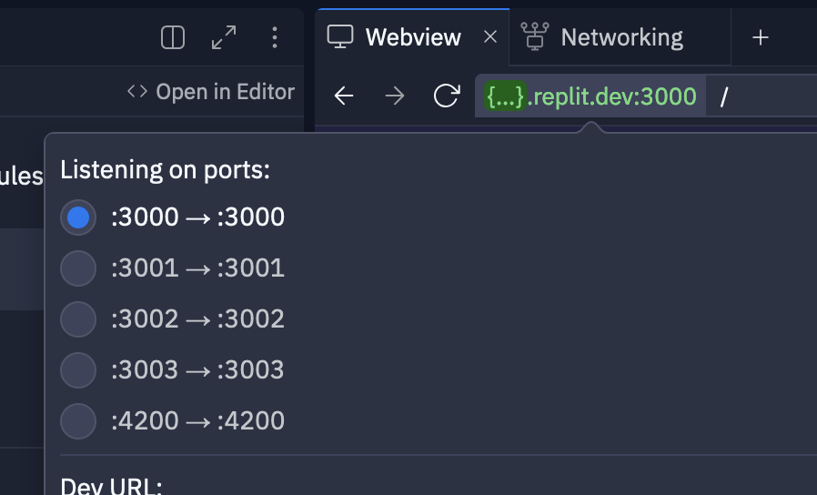

# Getting Started

This assessment is meant to test your skills and understanding of Module Federation in Vue3 using Webpack.

To get started, let's open a `Shell`. You can find this in the `Tools` in the bottom left corner of this workspace.

Let's install all of our dependencies:

```
pnpm bootstrap
```

> **`TIP`**: While this is running, continue through this README.


## Overview

We have four Federated Modules:
- `shop-global-ui`: Contains global components used by all other modules
- `shop-category`: Hosts the Category Detail Page
- `shop-product`: Hosts the Product Detail Page
- `shop-cart`: Hosts the Cart Page

### Module Components

Each Federated Module has a number of components that it exposes, and others that it consumes:

| Module           | Exposes           |
| :--------------- | :---------------- |
| `shop-global-ui` | `PageContainer`   |
| `shop-product`   | `ProductCard`     |
| `shop-product`   | `ProductListItem` |
| `shop-cart`      | `CartDialog`      |

Notice how each component is related to its module. Then, modules that need to display or utilize functionality from those other modules borrow the Components from the respective modules.

| Module           | Uses                             |
| :--------------- | :------------------------------- |
| `shop-global-ui` | `shop_cart/CartDialog`           |
| `shop-category`  | `shop_global_ui/PageContainer`   |
| `shop-product`   | `shop_global_ui/PageContainer`   |
| `shop-cart`      | `shop_global_ui/PageContainer`   |
| `shop-category`  | `shop_product/ProductCard`       |
| `shop-cart`      | `shop_product/ProductListItem`   |

## Starting

Let's start by opening a `Shell`. You can find this in the `Tools` in the bottom left corner of this workspace.

Inside, let's use `pnpm` to start webpack for each of our Federated Modules:

```
pnpm start
```

# Let's get to work!

Next, let's open up at least one Webview to view our modules.




This assessment is designed to progressively test your skills and understanding of Module Federation in Vue3 using Webpack. As you work through the levels, you’ll ramp up from basic UI updates to integrating APIs and solving complex problems. Ready? Let’s go!

## L1: Setting the Foundation

We’ll begin with small but essential UI tweaks. These tasks will help you get comfortable with the codebase and start making meaningful improvements.

### 1. Update the Header and Footer

Let’s clean up the text in the header and footer to make them more concise.

- **Header**:
  - Shorten `Women's Clothes` to `Women's`
  - Shorten `Men's Clothes` to `Men's`
- **Footer**:
  - Remove `Women's` and `Men's` from the beginning of each **_link_** in their respective categories.

> **`TIP`:** Small improvements like these can make a big difference in how users interact with your site. You’re off to a great start!

### 2. Beautify Product Cards and Add Hover States

Let’s improve the look and feel of the product cards. Add some hover states to buttons so users know they’re interactive.

> You’re adding some nice polish here! Keep it up—your UI is already looking better.

---

## L2: Fixing and Enhancing Components

Next, let’s dive into fixing existing components and making them more dynamic.

### 3. Fix the Cart Modal Dialog

The Cart Dialog is currently broken and doesn’t open. Your first task is to fix the mechanism that triggers the dialog, so the user can open and close it properly.

> **`HINT`:** Double-check the event handling for the `Cart` button. Sometimes it’s just a small tweak that can get everything working again!

### 4. Add Static Components to the Cart Dialog

Now that the Cart Dialog can be opened, let’s make it more useful. Add some static components to simulate items in the cart.

- Use the `ProductListItem` component to display static products in the dialog.
- At the bottom of the dialog, add a static "Subtotal" with a hardcoded price.

> You’re building something functional now! Getting these components into the dialog is a key step toward a fully dynamic cart.

---

## L3: Integrating APIs for Cart Functionality

Now that the Cart Dialog is fixed and displays static data, let’s integrate some real API functionality.

### 5. Implement Add to Cart

Let’s use the available composables to implement the `Add to Cart` functionality **on the Product Page** (`:3001`). This task will involve sending a POST request to the cart API to add an item when a user clicks the `Add to Cart` button on the product page.

> **`TIP`:** Check out the composables that are already available for working with the cart. This is where your backend integration starts!

### 6. Display Cart Items Using API Data

Next, let’s take the static components from L2 and replace them with dynamic data. You’ll need to send a GET request to retrieve the items added to the cart and display them in the Cart Dialog.

> **`HINT`:** Look at the composables you have, and how the static components are structured, then update them to pull in real data from the API. You’re making the cart dynamic!

---

## L4: Connecting APIs to Navigation

You’ve made great progress so far! Now, we’ll extend the API integration into other parts of the application.

### 7. Add Navigation Items to the Backend

Set up a simple API that will serve the navigation items. This will allow us to dynamically manage the items in our header and footer.

> You’re building a flexible, API-driven navigation system—way to go!

### 8. Integrate the Nav Items API

Update the header and footer components to dynamically pull in navigation items from the API you just created. This will make your navigation scalable and easy to maintain.

> **`PRO TIP`:** Think about how the API responses map to the existing navigation structure. Keep the logic clean and simple.

---

## L5: Complex Problem Solving

This is where the challenge gets real! These tasks will test your ability to work with advanced features and tackle more intricate problems.

### 9. Implement Vue Router for Product and Category Pages

Add routing for both product pages and category pages. Ensure users can navigate between pages smoothly, just like in a real-world application.

> **`CHALLENGE ACCEPTED!`:** If you can master routing, you’re well on your way to building complete web applications.

### 10. Share State Between Modules

Sharing state between federated modules is one of the more complex aspects of Module Federation. You’ll need to ensure that state (like cart data) can be shared across different modules to maintain a consistent user experience.

> **`EXPERT MODE`:** You’re almost at the finish line. If you’ve gotten this far, you’re tackling one of the hardest challenges in Module Federation!

---

## Wow! You made it!

Whether you completed L1 or made it all the way to L5, we’re seriously impressed by your progress. Each step you’ve taken has shown off your skills in design, development, and problem-solving.


<!-- - L1: Update Header and Footer text to be more consistent
- L1: Beautify Product Cards, Add Hover States to Buttons
- L2: Fix Cart Modal Dialog
- L2: Add Static Components to Cart Dialog
- L3: Implement Add to Cart on Product Page
- L3: Integrate Cart Dialog with Cart Store
- L4: Add Navigation Items to backend
- L4: Integrate Nav Items API into Header and Footer
- L5: Complex Problem Solving
  - Vue Router
    - Product Pages
    - Category Pages
  - Sharing State Between Modules


## 1. Update the Header

The first step is to update our [Header](shop-global-ui/src/components/header.vue) component. It's a bit crowded right now. We have two navigation items that are a little too verbose:
- `Women's Clothes`: Too specific, and too long. Let's shorten it to just `Women's`
- `Men's Clothes`: The same is true with this category. This one we'll just called `Men's`

## 2. Update the Footer

Next, let's clean up some redundancy in our [Footer](shop-global-ui/src/components/footer.vue) component.
- Remove `Women's` from the beginning of each **_link_** in the Women's category.
- Remove `Men's` from the beginning of each **_link_** in the Men's category.

## 3. Update the CartDialog

In the Webview, you'll notice two buttons displayed in the page header: `Cart` and `Sign-in`.

The `[Cart]` button opens a dialog when you click on it, but seems a little empty.

The dialog that is displayed is the [shop_cart/CartDialog](shop-cart/src/components/cart-dialog.vue) component.

Let's update this component to show some useful information:

1. Use the `shop_product/ProductListItem` to simulate some products in our cart.
	- **Hint:** _You can reference the [shop-cart](shop-cart/src/App.vue) page for how this component is being used there._
2. At the bottom of the dialog, let's show a static "Subtotal" with a hard-coded price.

## 4. Add a Checkout Button to our CartDialog

1. Add a `[Checkout]` button to the [shop_cart/CartDialog](shop-cart/src/components/shop-dialog.vue) component.
2. Configure the `[Checkout]` button to close the modal

## 5. Add a Checkout Button to our Cart Page

1. Add a `[Checkout]` button to the [shop-cart](shop-cart/src/App.vue) page.

# BONUS: ADVANCED: Checkout Page

As a bonus to show of your skills and familiarity with your new codebase, let's make things interesting! So far, you've utilized the assets available to you in order to modify an existing set of Federated Modules.

For the bonus, we'll want to:
1. Add a new `shop-checkout` module
2. Update the `[Checkout]` buttons to navigate to this module

## BONUS: 1. Create the module

In the shell, use `create-mf-app` to create a new module:

```
pnpx create-mf-app
```
Configure it like the following:
> ? **Pick the name of your app:** `shop-checkout`
> 
> ? **Project Type:** `Application`
> 
> ? **Port number:** `8084`
> 
> ? **Framework:** `vue3` _(Use arrow keys to scroll down)_
> 
> ? **Language:** `typescript`
> 
> ? **CSS:** `CSS`
> 
> ? **Bundler:** `Webpack`

Bootstrap your dependencies again:
```
pnpm bootstrap
```

## BONUS: 2. Configure The Module

Find the `Networking` tool in the bottom left of the workspace. Open it up and configure your new module using `+ New port`. Choose an External Port that hasn't been used yet, like `4200`.


Next, let's update our [modfeds.js](./modfeds.js) file so that the other modules know about it!

```typescript
const replitHost = process.env.REPLIT_DEV_DOMAIN;

module.exports = {
	default: {
		/* ... */
		shop_checkout: { // This is our new module
			internalPort: 8084, // This is the port we configured in create-mf-app
			externalPort: 4200, // Note the port your just configured in Networking
			host: `${replitHost}:4200`, // Add it here too
		},
		/* ... */
	}
}
```

## BONUS: 3. Configure `shop-checkout`'s Webpack

Open up your new [webpack.config.js](shop-checkout/webpack.config.js).

At the top, `require` our `modfeds.js` file, so that you can reference other modules. We'll also tell Webpack to make it available to us in the browser using the `DefinePlugin`:

```diff
+ const { DefinePlugin } = require("webpack");
+ const modfeds = require("../modfeds.js").default;
  
  module.exports = (_, argv) => ({
    /* ... */
    plugins: [
      /* ... */
+     new DefinePlugin({
+       modfeds: JSON.stringify(modfeds),
+     }),
    ],
  });
```

We'll also need to update a couple other settings in our `webpack.config.js` to make it work properly with Replit:
```diff
  module.exports = (_, argv) => ({
    output: {
-     publicPath: `https://localhost:8084/`,
+     publicPath: `https://${modfeds.shop_product.host}/`,
    },

    resolve: {
      extensions: [".tsx", ".ts", ".vue", ".jsx", ".js", ".json"],
    },

    devServer: {
      /* ... */
+     allowedHosts: "all",
      /* ... */
```

## BONUS: 4. Configure `shop-checkout` to use shop-global-ui's PageContainer

Inside `shop-checkout`'s [webpack.config.js](shop-checkout/webpack.config.js), we'll need to configure it to use `shop-global-ui` so that we can leverage the `PageContainer` component on our page. We'll also configure it to use the `ProductListItem` component from `shop-product` in case you get to the _bonus bonus_ :)

```diff
  module.exports = (_, argv) => ({
    /* ... */
  
    plugins: [
      /* ... */
      new ModuleFederationPlugin({
        name: "shop_product",
        filename: "remoteEntry.js",
-       remotes: {},
+       remotes: {
+         shop_global_ui: `shop_global_ui@https://${modfeds.shop_global_ui.host}/remoteEntry.js`,
+         shop_product: `shop_product@https://${modfeds.shop_product.host}/remoteEntry.js`,
+       },
        /* ... */
      })
```

Now that it's configured, let's update [shop-checkout's App.vue](shop-checkout/src/App.vue) to use the PageContainer component!

First, we'll need to import it:

```typescript
import PageContainer from "shop_global_ui/PageContainer";
```

Now, replace the `<div class="container">` with the `<PageContainer>` component.


## BONUS: 6. Build out our Checkout Page

For our Checkout page, we'll want the following:
1. A list of the products we have in our cart (using the ProductListItem component)
2. Add a summary with the following:
    - Subtotal
    - Tax
    - Shipping
    - Total
4. A shipping address form with the following fields:
    - First Name
    - Last Name
    - Address 1
    - Address 2
    - City
    - State
    - Zip
5. Next, we'll add a Payment Info form with the following fields:
    - Name on Card
    - Card Number
    - Card Expiration
    - Card Security Code (CVV/CVC/CSC)

## Wow! You made it!

Honestly, not many people get this far. And that's OK! But you **_absolutely nailed it!_** We're excited to see what you put together!

# BONUS BONUS: Update `[Checkout]` buttons

We added some `[Checkout]` buttons across the site earlier. Now that we have a page to navigate to, let's update these buttons to go to the Checkout page!

See if you can find out how we're currently navigating to different pages throughout the app by looking at other pages and components. (Hint: Have you tried clicking on any of the Nav links? I wonder if they'd be a good reference!)

As a refresher, we added `[Checkout]` buttons to the following locations:
- CardDialog
- Cart Page

## Did you really get this far?

Alright, this is getting excessive. 

# BONUS BONUS BONUS: Add a Checkout Success Page

We don't have a true router implemented, and currently each of our modules only have one page associated with them. Think you can be the first to change that? If you're up for it, knock yourself out!

1. Implement `vue-router`
2. Add a Success Page to `shop-checkout`
3. Add a `Pay` or `Submit` button to the main Checkout page that navigates to your Success Page.

## Seriously? You finished that too?

It's OK, I don't have a life either. I wrote this in my free time.  -->